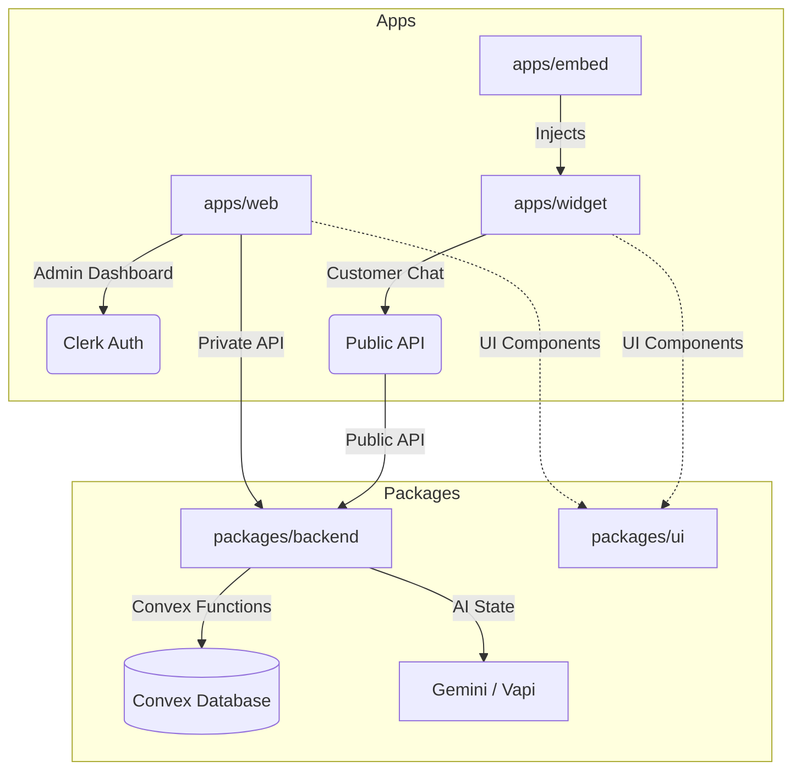

<div align="center">
  <h1>🚀 Omni</h1>
  <p><strong>Production-Grade Multi-Tenant AI Support Engine</strong></p>
  
  [](https://nextjs.org/)
  [](https://react.dev/)
  [](https://convex.dev/)
  [](https://clerk.dev/)
  [](https://vapi.ai/)
</div>

<br/>

**Omni** is a production-grade, multi-tenant AI customer support platform engineered for high-scale B2B environments. Built with a focus on **Real-Time Data Synchronization**, **Retrieval-Augmented Generation (RAG)**, and **Stateless Multi-Tenancy**, Omni allows organizations to deploy autonomous AI agents trained on custom knowledge bases to any external website via a secure, conflict-free embed script.

---

## 🌟 Key Engineering Features

### 🏢 Enterprise-Grade Multi-Tenancy
- **Stateless Tenant Isolation**: Leverages Clerk B2B JWT claims for cryptographic data partitioning at the database level, ensuring zero cross-tenant leakage without eventual-consistency webhook delays.
- **Dynamic Feature Gating**: Real-time subscription tier provisioning via Stripe webhooks, instantly updating database flags to lock/unlock premium AI features and seat counts.

### 🧠 Advanced RAG & AI Orchestration
- **Vector Search Pipeline**: Documents are autonomously chunked and embedded into a Convex vector database, enabling Gemini 2.0 to provide context-aware, hallucination-free responses.
- **Autonomous Escalation**: The system determines when a request exceeds its knowledge base, automatically flagging conversations for seamless human operator intervention via real-time database triggers.
- **Edge-Optimized Agents**: AI execution is handled entirely within the database layer using `@convex-dev/agent`, sidestepping Next.js serverless timeouts for long-running generative tasks.

### ⚡ Real-Time Distributed Architecture
- **Reactive State Sync**: A WebSocket-first architecture powered by Convex, ensuring sub-second UI updates for both support agents and end-customers without manual hydration or polling.
- **Conflict-Free Widget Distribution**: A Vite-compiled IIFE loader manages a secure cross-origin iframe handshake, injecting a React 19 widget onto any host site while completely isolating CSS/JS scopes.

---

## 🏗️ System Architecture & Data Flow

### The Monorepo Topology
Omni utilizes **Turborepo** to manage a strictly typed workspace, preventing schema drift across the entire stack.



### The Interaction Lifecycle
1. **Bootstrap**: Client embeds `<script src=".../embed.js" data-org="org_123">`.
2. **Handshake**: The script initializes a secure iframe and establishes `postMessage` communication for UI animations and event bubbling.
3. **Subscription**: The widget establishes a persistent WebSocket connection to Convex.
4. **Execution**: Messages trigger Convex mutations which orchestrate Vector RAG lookups, call Gemini 2.0, and stream tokens back to the reactive UI instantly.

---

## 🛠️ Tech Stack

| Layer | Technologies |
| :--- | :--- |
| **Frontend** | Next.js 15 (App Router), React 19, Tailwind CSS, Radix UI |
| **Backend** | Convex (Transactional Document Store & Vector DB) |
| **AI / ML** | Google Gemini 2.0, Vapi (Voice AI), `@convex-dev/agent` |
| **Auth** | Clerk (B2B Organization Multi-Tenancy) |
| **Billing** | Stripe + Clerk B2B Pricing Tables |
| **Tooling** | Turborepo, Vite, TypeScript, Sentry (Distributed Tracing) |

---

## 📡 Core Backend Primitives

Omni relies on real-time mutations rather than traditional REST patterns.

| Service / Action | Type | Rationale |
| :--- | :--- | :--- |
| `messages:send` | Mutation | Writes to DB and triggers internal AI Agent asynchronously within the transactional boundary. |
| `files:upload` | Action | Processes PDFs/Text, generates high-dimensional embeddings, and indexes in Vector DB. |
| `clerk:webhook` | HTTP Action | Verified via Svix; handles `subscription.updated` to enforce seat limits and feature access. |
| `vapi:voice` | Action | Securely retrieves per-org secrets from AWS Secrets Manager to initiate WebRTC voice sessions. |
| `conversations:resolve`| Mutation | Closes the thread and halts AI execution state machines. |

---

## 🚀 Quick Start

### 📋 Prerequisites
- Node.js >= 20.0.0
- `pnpm` (Workspace Manager)
- API Keys for Clerk, Stripe, Google Gemini, and Convex.

### 1. Installation
```bash
git clone https://github.com/Ritika24HOODA06/Omni-desk.git
cd Omni-desk
pnpm install
```

### 2. Environment Configuration
Create a `.env` in the root and configure your keys (see `Omni_MASTERCLASS_DECONSTRUCTION.md` for full variable map):
```env
# Root / apps/web
NEXT_PUBLIC_CLERK_PUBLISHABLE_KEY=pk_test_...
CLERK_SECRET_KEY=sk_test_...
NEXT_PUBLIC_CONVEX_URL=...
```

### 3. Execution
```bash
pnpm dev
```
- **Admin Dashboard**: `http://localhost:3000`
- **Widget Playground**: `http://localhost:3001`

---

## 🛡️ Security & Observability

- **Edge-Level Security**: Clerk middleware traps unauthenticated traffic at the Vercel Edge, preventing unauthorized compute consumption.
- **Secret Management**: Multi-tenant API keys (Vapi) are parsed via `getSecretValue` and never exposed to the client-side.
- **Distributed Tracing**: Native Sentry instrumentation in Next.js 15 tracks errors across the Edge, Node.js server, and client runtimes with 100% trace coverage.

## 📈 Scalability Roadmap

1. **Denial of Wallet Protection**: Implementing strict `Origin` header validation against database-stored `whitelistDomains` for all widget initializations.
2. **AI Rate Limiting**: Token-bucket implementation at the Convex edge to throttle excessive generative requests per IP/Org.
3. **E2E Resilience**: Expanding Playwright suites to simulate cross-origin iframe handshakes across diverse browser security profiles.

---
*Architected and developed with precision by **Ritika**.*

